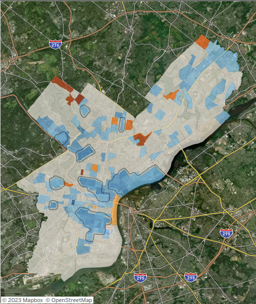

 <a href="Gentrification.html" title="Gentrification Interactive Dashboard">Gentrification Interactive Dashboard</a>

<a href = "https://samfraley.github.io">

 <a href="Good-Jobs-Lab-Fellow-Assessment.html" title="GJC Assessment">GJC Assessment</a>

 <a href="inflation.html" title="Inflation Analysis - Summer 2022"> Inflation Analysis - Summer 2022 </a>

 <a href="currentconditions.html" title="Philadelphia Current Labor Market Conditions Dashboard"> Philadelphia Current Labor Market Conditions Dashboard </a>

 <a href="cluster.html" title="Philadelphia Industry Clusters Dashboard"> Philadelphia Industry Clusters Dashboard </a>

