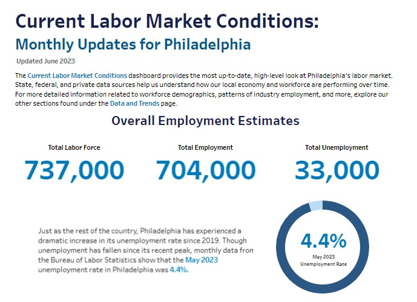
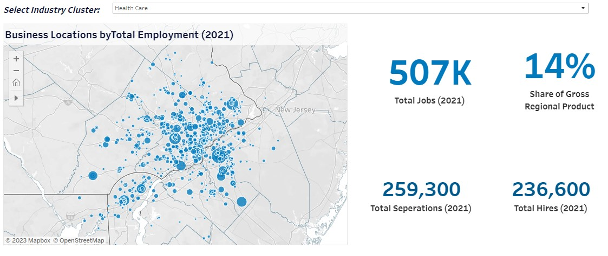

 <a href="Gentrification.html" title="Gentrification Interactive Dashboard">Gentrification Interactive Dashboard</a>

<a href = "https://samfraley.github.io/Portfolio/Gentrification.html">

 <a href="Good-Jobs-Lab-Fellow-Assessment.html" title="Exploring Rural vs. Non- Rural Wages">Exploring Rural vs. Non- Rural Wages</a>
<a href = "https://samfraley.github.io/Portfolio/Good-Jobs-Lab-Fellow-Assessment.html">

 <a href="inflation.html" title="Inflation Analysis - Summer 2022"> Inflation Analysis - Summer 2022 </a>
<a href = "https://samfraley.github.io/Portfolio/inflation.html">

 <a href="currentconditions.html" title="Philadelphia Current Labor Market Conditions Dashboard"> Philadelphia Current Labor Market Conditions Dashboard </a>
<a href = "https://samfraley.github.io/Portfolio/currentconditions.html">

 <a href="Clusters.html" title="Philadelphia Industry Clusters">Philadelphia Industry Clusters</a>
<a href = "https://samfraley.github.io/Portfolio/Clusters.html">

