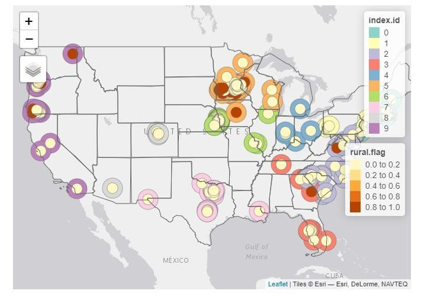
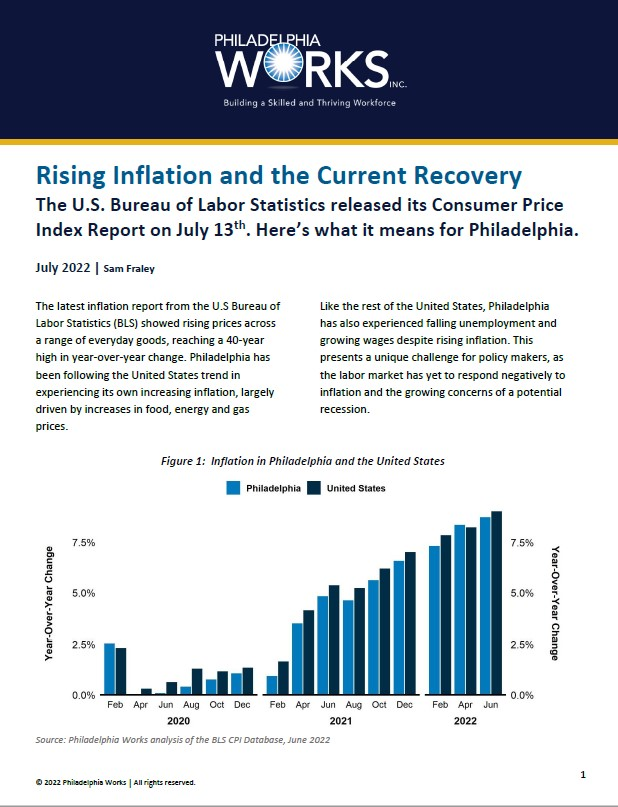

```{css echo=FALSE}
.bordered{
  border-style: solid;
  width: auto;

}

```


<font size = "5"> <a href="Gentrification.html" title="Gentrification Interactive Dashboard">Gentrification Interactive Dashboard</a></font>


<font size = "5"> <a href="Good-Jobs-Lab-Fellow-Assessment.html" title="Exploring Rural vs. Non- Rural Wages">Exploring Rural vs. Non- Rural Wages</a></font>


<font size = "5"> <a href="inflation.html" title="Inflation Analysis - Summer 2022"> Inflation Analysis - Summer 2022 </a></font>


<font size = "5"> <a href="currentconditions.html" title="Philadelphia Current Labor Market Conditions Dashboard"> Philadelphia Current Labor Market Conditions Dashboard </a></font>


<font size = "5"> <a href="Clusters.html" title="Philadelphia Industry Clusters">Philadelphia Industry Clusters</a></font>


