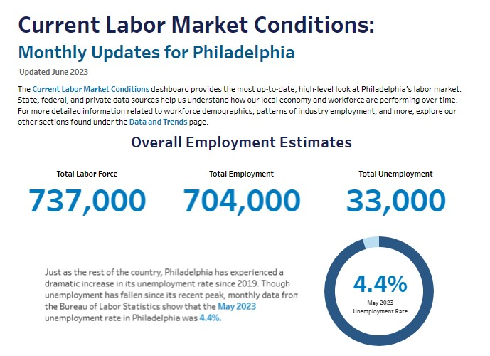
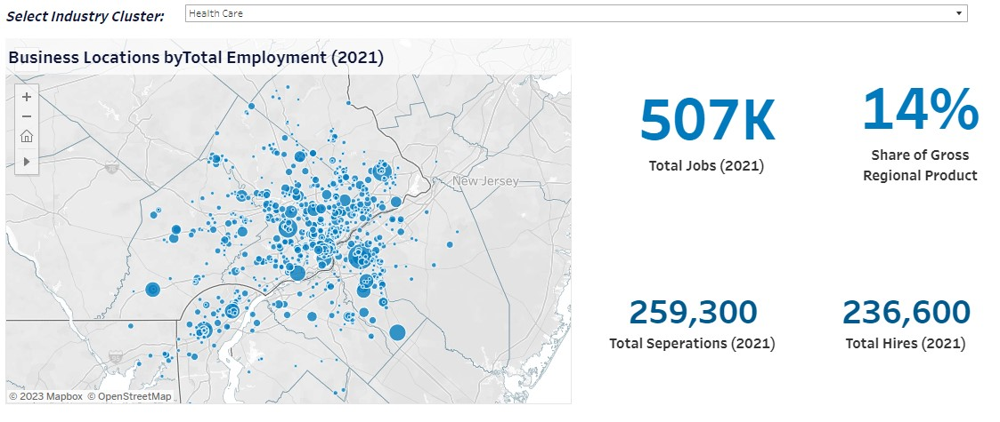
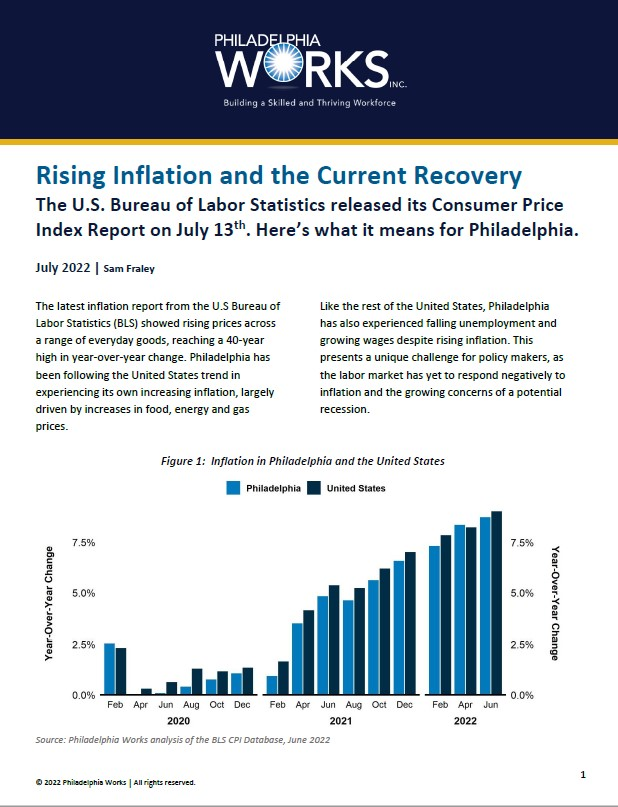
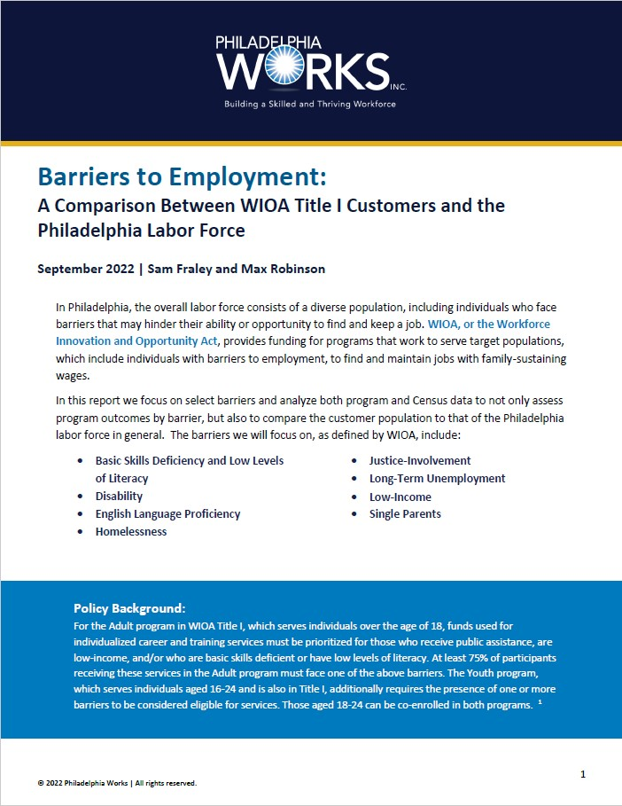
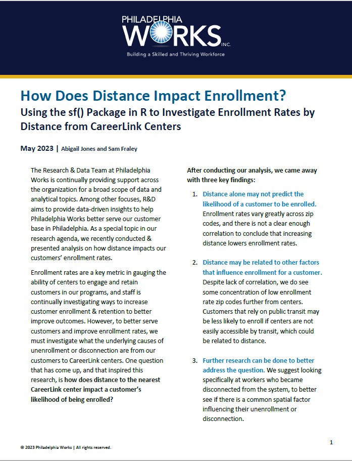
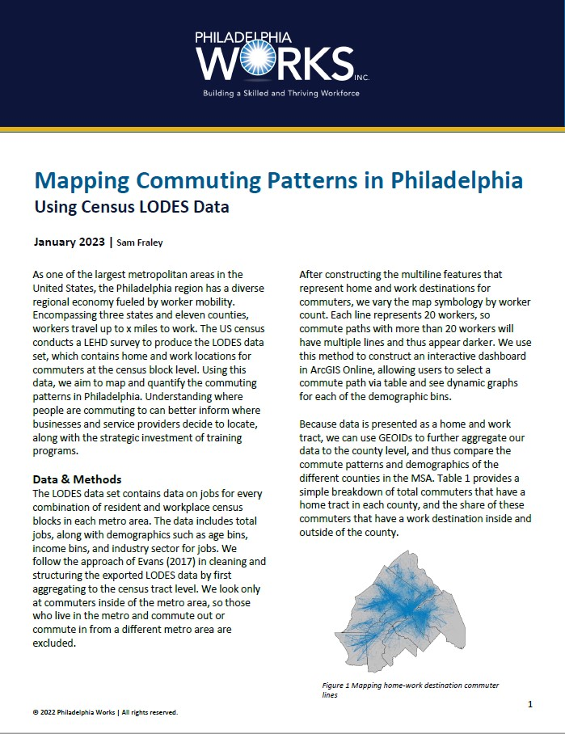
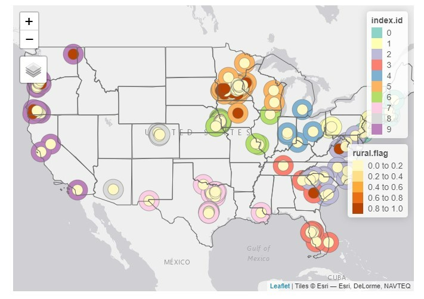

```{css echo=FALSE}
.bordered{
  border-style: solid;
  width: auto;

}

```


<font size = "6.8"> <b> Executive Dashboards: </b> </font>

<font size = "3"> <i> I design, update, and maintain these Tableau-based dashboards </i> </b> </font>

<font size = "5"> <a href="currentconditions.html" title="Philadelphia Current Labor Market Conditions Dashboard"> Philadelphia Current Labor Market Conditions Dashboard </a></font>


<font size = "5"> <a href="Clusters.html" title="Philadelphia Industry Clusters">Philadelphia Industry Clusters</a></font>


<font size = "5"> <a href="Gentrification.html" title="Gentrification Interactive Dashboard">Gentrification Interactive Dashboard</a></font>


<font size = "6.8"> <b> Research Memos/Briefs: </b> </font>

<font size = "3"> <i> Produced for external use </i> </b> </font>

<font size = "5"> [Inflation Analysis Memo - Summer 2022](https://github.com/samfraley/Portfolio/blob/master/images/inflation22.pdf) </font>
<font size = "2"> <a href="inflation.html" title="Code Markdown"> Code Markdown </a></font>


<font size = "5"> [Analyzing WIOA Title I Barriers](https://github.com/samfraley/Portfolio/blob/master/images/barriers.pdf)</a></font>


<font size = "5"> [Does Distance Impact Enrollment Rate? ](https://github.com/samfraley/Portfolio/blob/master/images/distance.pdf)</a></font>


<font size = "5"> [Mapping LODES Commute Patterns ](https://github.com/samfraley/Portfolio/blob/master/images/LODES%20Commuting%20Analysis%20-%20DRAFT.pdf)</a></font>


<font size = "5"> <a href="Good-Jobs-Lab-Fellow-Assessment.html" title="Exploring Rural vs. Non- Rural Wages">Exploring Rural vs. Non- Rural Wages</a></font>


